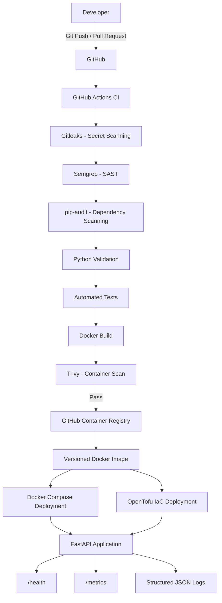

# SecurePipe Lite

SecurePipe Lite is a lightweight DevSecOps portfolio project that demonstrates a secure software delivery lifecycle from source code to a versioned container deployment.

The project combines automated testing, security scanning, Docker containerization, GitHub Actions CI/CD, GitHub Container Registry, release versioning, rollback, Infrastructure as Code with OpenTofu, and basic application observability.

The project was intentionally designed to remain lightweight and runnable on modest hardware without requiring paid cloud infrastructure.

---

## Architecture



---

## DevSecOps Pipeline

Every push or pull request is automatically validated through GitHub Actions.

```text
Source Code
    |
    v
Gitleaks
Secret Detection
    |
    v
Semgrep
Static Application Security Testing
    |
    v
pip-audit
Software Composition Analysis
    |
    v
Python Validation
    |
    v
Automated Tests
    |
    v
Docker Build
    |
    v
Trivy
Container Vulnerability Scanning
    |
    v
Security Gate
    |
    v
GitHub Container Registry
```

A failure in the required CI job prevents a protected pull request from being merged into `main`.

---

## Security Controls

SecurePipe Lite implements several security controls across the software delivery lifecycle.

| Area | Control |
|---|---|
| Secrets | Gitleaks |
| Source Code | Semgrep SAST |
| Dependencies | pip-audit |
| Containers | Trivy |
| Container Runtime | Non-root `appuser` |
| CI Supply Chain | GitHub Actions pinned to immutable commit SHAs |
| Secrets Management | `.env`, GitHub Secrets, runtime injection |
| Git Protection | Required pull requests and CI checks |
| Image Distribution | Versioned GHCR images |
| Deployment | Immutable release tags |
| Recovery | Version rollback |
| Infrastructure | OpenTofu IaC |
| Runtime | Docker health checks |
| Visibility | Structured logs and metrics |

---

## Application

SecurePipe Lite contains a small FastAPI application used to demonstrate the DevSecOps lifecycle.

### Root Endpoint

```text
GET /
```

Example:

```json
{
  "message": "SecurePipe Lite is running"
}
```

### Health Endpoint

```text
GET /health
```

Example:

```json
{
  "status": "healthy",
  "environment": "production",
  "secret_configured": true
}
```

The application reports only whether a secret has been configured. The secret value itself is never returned.

### Metrics Endpoint

```text
GET /metrics
```

Example:

```json
{
  "requests_total": 10,
  "uptime_seconds": 42.31,
  "environment": "production"
}
```

---

## Structured Logging

HTTP requests generate structured JSON log events.

Example:

```json
{
  "event": "http_request",
  "method": "GET",
  "path": "/health",
  "status_code": 200,
  "duration_ms": 1.42,
  "environment": "production"
}
```

Sensitive values such as application secrets, authorization headers, cookies, and request bodies are not included in these request logs.

---

## Project Structure

```text
securepipe-lite/
|
|-- .github/
|   `-- workflows/
|       `-- ci.yml
|
|-- app/
|   `-- main.py
|
|-- infra/
|   |-- .terraform.lock.hcl
|   |-- main.tf
|   |-- outputs.tf
|   |-- variables.tf
|   `-- versions.tf
|
|-- tests/
|   `-- test_app.py
|
|-- .dockerignore
|-- .env.example
|-- .gitignore
|-- compose.deploy.yaml
|-- compose.yaml
|-- Dockerfile
|-- README.md
`-- requirements.txt
```

---

## Local Development

### Requirements

- Git
- Python 3.13+
- Docker
- Docker Compose
- OpenTofu for the IaC exercises

Clone the repository:

```bash
git clone https://github.com/fareed-wq/securepipe-lite.git
cd securepipe-lite
```

Create a Python virtual environment:

### Windows

```cmd
python -m venv venv
venv\Scripts\activate
```

Install dependencies:

```cmd
python -m pip install -r requirements.txt
```

Run the application:

```cmd
python -m uvicorn app.main:app --reload
```

Open:

```text
http://127.0.0.1:8000
```

Swagger documentation:

```text
http://127.0.0.1:8000/docs
```

---

## Automated Tests

Run:

```bash
python -m pytest -v
```

The tests verify the application, health endpoint, and monitoring endpoint.

---

## Environment Configuration

Copy the example configuration:

```bash
cp .env.example .env
```

Example:

```env
APP_ENV=development
APP_SECRET=replace-with-your-secret
```

`.env` is excluded from Git and should never be committed.

`.env.example` documents the required variables without containing real credentials.

---

## Docker

Build the image:

```bash
docker build -t securepipe-lite .
```

Run:

```bash
docker run -d \
  --name securepipe-lite \
  -e APP_ENV=production \
  -p 8000:8000 \
  securepipe-lite
```

Verify:

```bash
curl http://127.0.0.1:8000/health
```

The image runs using the non-root user:

```text
appuser
```

Verify:

```bash
docker exec securepipe-lite id
```

---

## Docker Health Check

The Docker image contains a native `HEALTHCHECK`.

Check:

```bash
docker ps
```

A healthy container reports:

```text
Up ... (healthy)
```

---

## Docker Compose

Local orchestration is available through:

```bash
docker compose up -d --build
```

Check:

```bash
docker compose ps
```

View logs:

```bash
docker compose logs
```

Stop the application:

```bash
docker compose down
```

---

## GitHub Container Registry

Successful builds from `main` are published to GitHub Container Registry.

Latest image:

```text
ghcr.io/fareed-wq/securepipe-lite:latest
```

Pull:

```bash
docker pull ghcr.io/fareed-wq/securepipe-lite:latest
```

Run:

```bash
docker run -d \
  --name securepipe-ghcr \
  -p 8000:8000 \
  ghcr.io/fareed-wq/securepipe-lite:latest
```

Images are also tagged using their Git commit SHA for traceability.

Release tags such as:

```text
v1.0.0
v1.1.0
```

produce versioned container images.

Example:

```bash
docker pull ghcr.io/fareed-wq/securepipe-lite:v1.1.0
```

---

## Versioned Deployment

`compose.deploy.yaml` deploys pre-built images from GHCR rather than rebuilding source code on the deployment host.

Deploy a version:

```bash
APP_VERSION=v1.1.0 docker compose -f compose.deploy.yaml pull
APP_VERSION=v1.1.0 docker compose -f compose.deploy.yaml up -d
```

Verify the deployed image:

```bash
docker inspect securepipe-deploy --format='{{.Config.Image}}'
```

---

## Rollback

A previous release can be restored by changing the image version.

Example:

```bash
APP_VERSION=v1.0.0 docker compose -f compose.deploy.yaml pull
APP_VERSION=v1.0.0 docker compose -f compose.deploy.yaml up -d
```

This allows recovery using an immutable known-good container image.

---

## Infrastructure as Code

The `infra/` directory contains OpenTofu configuration that manages the SecurePipe Lite Docker deployment declaratively.

Initialize:

```bash
cd infra
tofu init
```

Validate:

```bash
tofu validate
```

Preview infrastructure:

```bash
tofu plan
```

Create infrastructure:

```bash
tofu apply
```

Inspect managed resources:

```bash
tofu state list
```

Destroy the lab infrastructure:

```bash
tofu destroy
```

Local OpenTofu state and provider cache files are excluded from Git.

The provider dependency lock file is committed for reproducible provider selection.

---

## Infrastructure Variables

OpenTofu exposes configurable values including:

```text
app_version
app_environment
host_port
```

Example:

```bash
tofu plan -var="app_environment=staging"
```

This demonstrates declarative infrastructure changes and state reconciliation.

---

## CI/CD Security Gates

The pipeline currently includes:

### Gitleaks

Detects credentials, tokens, API keys, and other secrets accidentally committed to source control.

### Semgrep

Performs Static Application Security Testing against application code and configuration.

### pip-audit

Checks Python dependencies against known vulnerability databases.

### Trivy

Scans the final Docker image for HIGH and CRITICAL operating-system and application-library vulnerabilities.

### Automated Tests

Functional tests verify expected application behavior before an image is published.

---

## Secure CI Practices

The workflow also demonstrates:

- GitHub Actions pinned to immutable commit SHAs
- Minimum workflow permissions
- GitHub Secrets
- Runtime secret injection
- Required CI status checks
- Pull-request-based changes
- Protected `main` branch
- Container vulnerability gating
- Versioned deployment artifacts

---

## Secret Management

Secrets are handled differently depending on their use.

### Local Development

```text
.env
```

The file is excluded through `.gitignore`.

### Documentation

```text
.env.example
```

Contains placeholders only.

### CI/CD

Sensitive CI values are stored using GitHub Actions repository secrets.

The workflow references secrets using GitHub's secret context instead of storing values directly in YAML.

---

## Release Strategy

SecurePipe Lite uses semantic versioning:

```text
MAJOR.MINOR.PATCH

v1.0.0
v1.1.0
v1.1.1
```

Release images are immutable deployment artifacts.

Git commit SHA tags provide additional traceability between source code and container images.

---

## Branch Protection

The `main` branch is protected.

Changes follow:

```text
Feature Branch
      |
      v
Pull Request
      |
      v
Required CI
      |
      +-- Gitleaks
      +-- Semgrep
      +-- pip-audit
      +-- Tests
      +-- Docker Build
      `-- Trivy
      |
      v
Merge Allowed
```

Failed required checks prevent the pull request from being merged.

---

## DevSecOps Concepts Demonstrated

This project demonstrates practical experience with:

- Git and GitHub
- Feature branch workflows
- Pull requests
- Branch protection
- Continuous Integration
- Continuous Delivery
- Python testing
- FastAPI
- Docker
- Docker Compose
- GitHub Actions
- GitHub Container Registry
- Semantic versioning
- Release management
- Immutable container artifacts
- Rollback strategies
- Secret management
- SAST
- SCA
- Secret scanning
- Container vulnerability scanning
- Supply-chain hardening
- Non-root containers
- Application health checks
- Structured logging
- Basic application metrics
- Infrastructure as Code
- OpenTofu
- Infrastructure state
- Idempotency

---

## Security Philosophy

SecurePipe Lite follows a shift-left approach.

Security checks are performed before deployment rather than relying only on runtime detection.

```text
Code
 |
Security
 |
Testing
 |
Container
 |
Container Security
 |
Approved Artifact
 |
Deployment
 |
Monitoring
```

The objective is to prevent vulnerable or improperly configured software from progressing through the delivery pipeline.

---

## Why SecurePipe Lite?

Many DevOps portfolio projects focus only on building and deploying an application.

SecurePipe Lite focuses on the complete secure delivery lifecycle:

```text
Build
+
Test
+
Scan
+
Package
+
Publish
+
Deploy
+
Rollback
+
Manage Infrastructure
+
Observe
```

It is intentionally lightweight enough to run locally while demonstrating concepts commonly used in larger DevSecOps environments.

---

## Future Enhancements

Possible future extensions include:

- Prometheus metrics
- Grafana dashboards
- Centralized log aggregation
- Remote OpenTofu state
- Cloud deployment
- Kubernetes
- Helm
- GitOps
- Argo CD
- SBOM generation
- Image signing
- Deployment environments and approval gates

These are considered future extensions rather than requirements for the core SecurePipe Lite project.

---

## Disclaimer

SecurePipe Lite is an educational and portfolio project designed to demonstrate DevOps and DevSecOps engineering practices.

It should be adapted, reviewed, and hardened further before being used for production workloads.