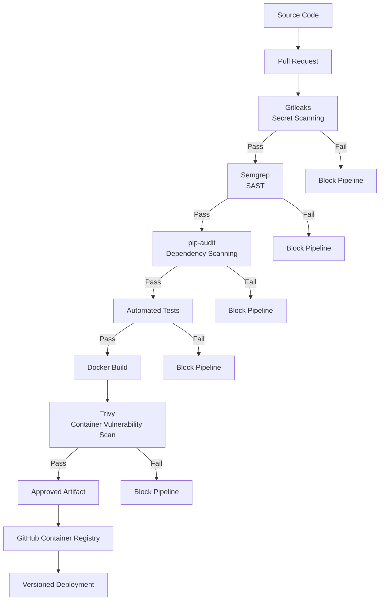

# SecurePipe Lite DevSecOps Pipeline

## Security Pipeline



## Security Gates

```text
                    SECUREPIPE LITE

Developer
    |
    v
Feature Branch
    |
    v
Pull Request
    |
    v
+-------------------------------+
| Gitleaks                      |
| Secret Detection              |
+-------------------------------+
    |
    v
+-------------------------------+
| Semgrep                       |
| Static Application Security   |
+-------------------------------+
    |
    v
+-------------------------------+
| pip-audit                     |
| Dependency Vulnerabilities    |
+-------------------------------+
    |
    v
+-------------------------------+
| Automated Tests               |
| Functional Validation         |
+-------------------------------+
    |
    v
+-------------------------------+
| Docker Build                  |
+-------------------------------+
    |
    v
+-------------------------------+
| Trivy                         |
| Container Vulnerabilities     |
+-------------------------------+
    |
    v
Required CI Check
    |
    v
Merge Allowed
    |
    v
GHCR
    |
    v
Versioned Release
```

## Shift-Left Security

Security validation happens before deployment.

A finding in a required security stage causes the CI job to fail, preventing the protected pull request from being merged until the issue is remediated.

The project currently demonstrates:

- Secret scanning with Gitleaks
- SAST with Semgrep
- Software Composition Analysis with pip-audit
- Automated regression testing
- Container vulnerability scanning with Trivy
- Non-root container execution
- Immutable GitHub Actions references
- GitHub Secrets
- Protected branch enforcement
- Versioned container artifacts
- Deployment rollback